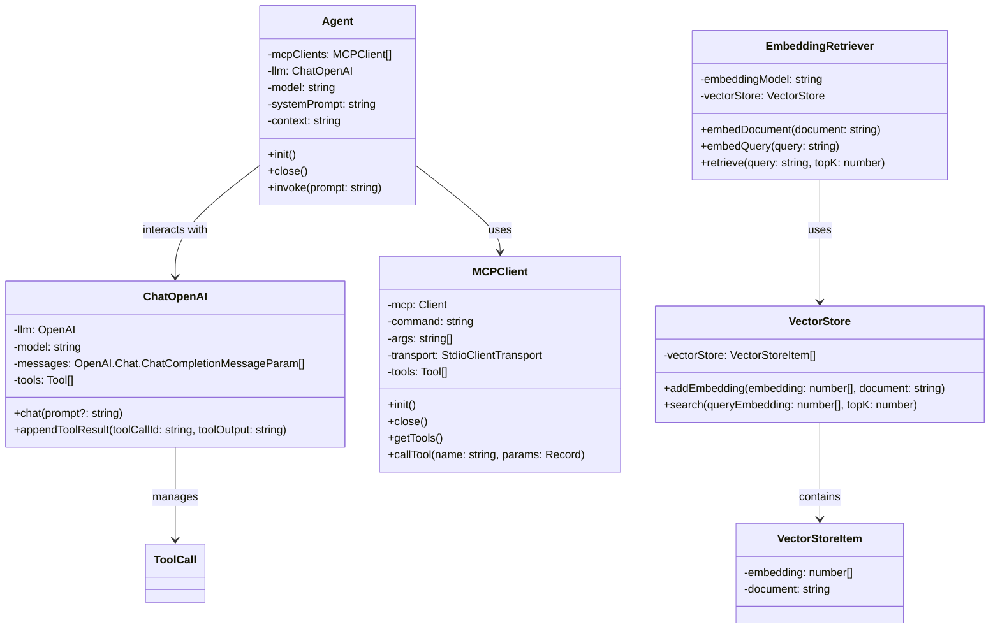

# MAXLAW - Intelligent Legal Knowledge QA System

## Project Introduction

MAXLAW is an intelligent legal knowledge question-answering system based on large language models, integrating the following key technologies:

- **Enhanced LLM** (LLM + MCP + RAG) - Improves the answering capability of large language models through knowledge retrieval
- **MCP Tool Integration** - Configurable with multiple MCP Servers to extend model functionality
- **Legal Knowledge RAG** - Retrieval-augmented generation system for the legal domain, providing accurate legal knowledge consultation

## System Architecture



## Features

- **Legal Knowledge Base Integration**: Includes knowledge from multiple legal domains such as civil code, company law, contract law, labor law, and intellectual property
- **Intelligent Retrieval**: Automatically retrieves relevant legal provisions and cases from the knowledge base, providing accurate legal basis
- **Web Interface**: Intuitive and user-friendly interface with markdown format answer display

## Planned Future Features

- **Multi-Session Management**: Support for multiple chat sessions to handle different legal questions simultaneously
- **Chat History**: Save and recall previous conversations
- **Model Selection**: Dropdown interface to select different language models from various providers:
  - OpenAI models (GPT-3.5, GPT-4, etc.)
  - HuggingFace models (Llama, Mistral, etc.)
  - Local models via MCP integration
- **Custom Knowledge Base Management**: Interface for uploading and managing custom legal documents

## Quick Start

### Requirements
- Node.js v18+
- npm or pnpm

### Installation
```bash
# Clone repository
git clone https://github.com/MoreClosersy/MAXLAW.git
cd MAXLAW

# Install dependencies
pnpm install

# Build the project
pnpm run build

# Start development server
pnpm run dev

# Or start production server
pnpm start
```

### Configuration
Create a `.env` file in the project root directory and configure the following environment variables:
```
OPENAI_API_KEY=your_openai_api_key
HUGGINGFACE_API_KEY=your_huggingface_api_key
```

## Knowledge Base

The current system integrates knowledge from the following legal domains:

- [Retrieval Augmented Generation](https://scriv.ai/guides/retrieval-augmented-generation-overview/)

- Loaders: https://python.langchain.com/docs/integrations/document_loaders/
- HuggingFace: 
  - [Embedding Models](https://huggingface.co/models)
  - Used for embedding generation and potentially for self-hosted LLMs

- OpenAI:
  - [OpenAI API Documentation](https://platform.openai.com/docs/api-reference)
  - [OpenAI Embedding Models](https://platform.openai.com/docs/guides/embeddings)
  - [Chat Completions API](https://platform.openai.com/docs/api-reference/chat)
  - Used for generating text embeddings and powering the conversational AI

## Technology Stack

- **Frontend**: HTML, CSS, JavaScript/React
- **Backend**: Node.js, TypeScript
- **RAG Implementation**: OpenAI Embedding API + Vector Retrieval
- **LLM Integration**: OpenAI API
- **MCP Tools**: Model Context Protocol