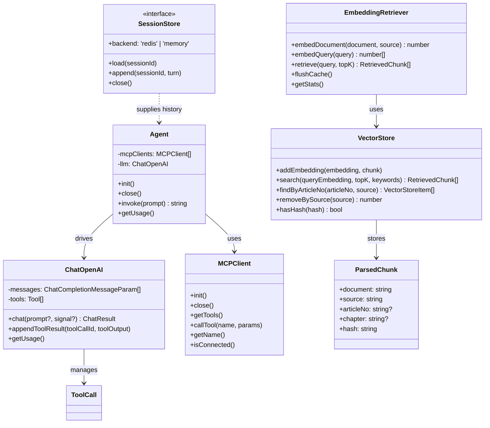

# MAXLAW — Legal Knowledge QA over the Chinese Civil Code

MAXLAW answers Chinese legal questions with citations to the statute text. Every article
it cites is looked up in a local corpus that has been verified article-by-article against
two independent official sources, and every 第X条 in the answer is checked back against the
corpus before it reaches the reader.

It is an honest system rather than a finished one: §Evaluation reports numbers that are
mediocre in places, and each is reported with the error rate that bounds it rather than on
its own. Where measurement contradicted the design — the similarity threshold that was
supposed to drive abstention — the number is in the repository and the design was replaced,
and the replacement is held to the same standard.

## What it actually does

- **Statute-grounded retrieval.** The corpus is the full text of the 民法典 (1,260
  articles) and the 2023-revised 公司法 (266 articles), chunked by article — not by token
  window — so a retrieved chunk is exactly one 第X条 with its 编/章/节 path attached.
  Headings are chunked too, but marked `kind: 'heading'` and excluded from the retrieval
  pool — see §Evaluation for why that mattered more than it sounds.
- **Streaming answers with citations.** The web UI consumes a Server-Sent Events stream and
  renders tokens as they arrive, alongside the retrieved articles.
- **Abstention — implemented, measured, and replaced.** Questions the corpus cannot answer are
  refused by an LLM judge that must **name** the article answering the question; naming nothing
  means refusing. The previous design — a threshold on the top retrieval score — is still in the
  tree as a pre-filter and a fallback, but it is no longer the mechanism: measured, it refused 3
  of 42 out-of-domain questions and the signal itself does not separate in-domain from
  out-of-domain questions. Both are documented with their numbers, including the one that limits
  the new result — see §Abstention.
- **Citation verification.** Every 第X条 the model cites is looked up in the store
  *numerically* — 「第577条」and「第五百七十七条」are the same article — and classified
  `verified`, `not_in_context` (a real article, but cited from memory rather than from what
  was actually retrieved), or `fabricated`. The UI renders the report and the server logs a
  warning. Nothing is auto-corrected: a silently rewritten citation is harder to audit than
  a flagged one.
- **No fabricated cases.** The system prompt (`prompts/legal-system-prompt.v3.md`) forbids
  presenting any case as real, because the corpus contains statute text only. Hypotheticals
  must be explicitly labelled as such.
- **MCP tools.** A fetch server and a sandboxed filesystem server are exposed to the model
  as callable tools, held as process-wide singletons.

## Corpus

| File | Law | Articles | Verified against |
|---|---|---|---|
| `knowledge/民法典.md` | 中华人民共和国民法典 (2020) | 1,260 | 广州人大 (新华社受权发布全文) + 北京市人大常委会 |
| `knowledge/公司法.md` | 中华人民共和国公司法 (2023 修订) | 266 | 最高人民法院国际商事法庭 + 辽宁省高级人民法院 |

Correctness of the statute text is the one thing a legal RAG system cannot be sloppy about,
so the corpus is built and checked mechanically rather than transcribed by hand:

```bash
# Rebuild from two official sources. Refuses to emit anything if the checks fail.
python3 tools/build_corpus.py <primary.html> <cross-check.html> knowledge/民法典.md "中华人民共和国民法典" \
  --url=<primary-url> --source-name="..." --check-url=<cross-url> --check-name="..."

pnpm lint:corpus      # structural checks (duplicate/misplaced/gapped/truncated articles)
pnpm corpus:manifest  # refresh knowledge/CORPUS.json
```

`tools/build_corpus.py` runs three checks and exits non-zero if any fails:

1. article numbers are contiguous, with no gaps and no duplicates;
2. the 编/章/节 sequence in the page's table of contents matches the sequence derived from
   the body, node for node;
3. every article is identical across the two independent sources.

Each run writes `knowledge/SOURCES.json`, recording both source URLs, the SHA-256 of each
fetched page, the SHA-1 of the emitted markdown, the checks that ran, and every
transformation applied (punctuation normalisation, trailing page-footer removal). The
provenance for both files is also embedded in `knowledge/CORPUS.json`.

`knowledge/CORPUS.json` carries a `version` and a `corpusHash`. **recall@k and MRR are not
comparable across corpus versions** — the candidate pool changes, so the denominator does.
The manifest exists so an eval report can state which corpus it measured.

> History: v1 of this corpus was hand-transcribed. An audit against official text found
> 73 of 209 sampled articles wrong (34.9%) — including misnumbered articles and a
> fabricated cross-reference. It was replaced wholesale with the verified text above.

## Evaluation

`pnpm eval` runs `eval/dataset.jsonl` (69 questions) against the corpus and writes
`eval/report.json`. It is **retrieval-only by default** — `--generate` adds answer
generation and citation accuracy — because retrieval metrics are deterministic and can gate
CI, while generation metrics are noisy and cost money.

Before measuring anything, the harness re-validates every ground-truth fingerprint against
the live corpus and refuses to run if one has gone stale. This is not ceremony: it caught
two bad answer keys on the first run, and a silently wrong answer key reports a confident
0.000, which is worse than reporting nothing.

| Category | n | hit@1 | hit@3 | hit@5 | MRR | abstained |
|---|---|---|---|---|---|---|
| `article_lookup` | 4 | 1.000 | 1.000 | 1.000 | 1.000 | 0.000 |
| `semantic` | 21 | 0.714 | 0.905 | 1.000 | 0.823 | 0.000 |
| `near_duplicate` | 2 | 1.000 | 1.000 | 1.000 | 1.000 | 0.000 |
| `out_of_domain` | 42 | — | — | — | — | **0.071** |
| **overall (27 with ground truth)** | **27** | **0.778** | **0.926** | **1.000** | **0.862** | 0.000 |

Every ground-truth article now lands in the top 5 — hit@5 is **1.000**, so there are no
recall failures left. The remaining gap is entirely *ranking*: 6 of 27 questions have the
right article somewhere in the top 5 but not at rank 1. That is a different problem with a
different fix (a reranker), and it is the reason the next step was not "better embeddings" —
see §Reranking for what happened when one was added.

Corpus v2 · 1,526 articles · `corpusHash 39727cfdca37a660` · dataset `ddfa161d6775` ·
topK 5 · `EMBEDDING_MODEL=BAAI/bge-base-zh-v1.5` (768-dim). The embedding model belongs in
that list: swapping it changes every score while the corpus fingerprint stays byte-identical,
so a report that omits it makes two incomparable numbers look like the same measurement.

### The embedding model was chosen by measurement, not by preference

Same corpus (`39727cfdca37a660`), same dataset (`ddfa161d6775`), same code — only the
embedding model differs. Because both fingerprints are identical across the two runs, the
model is the only variable that can explain the difference:

| | MiniLM-L12 (384-dim) | bge-base-zh-v1.5 (768-dim) |
|---|---|---|
| `article_lookup` hit@1 | 1.000 | 1.000 |
| `semantic` hit@1 / hit@5 / MRR | 0.476 / 0.667 / 0.549 | **0.714 / 1.000 / 0.823** |
| `near_duplicate` hit@1 | 1.000 | 1.000 |
| **overall hit@1 / hit@5 / MRR** | 0.593 / 0.741 / 0.649 | **0.778 / 1.000 / 0.862** |

Seven of 21 `semantic` questions missed the top-5 on MiniLM; **none** do on bge. Those seven
were all the same failure shape — colloquial phrasing with **no surface overlap** with the
statutory wording ("别人欠我钱一直不还，过了多久法院就不保护了？" → 诉讼时效). A
general-purpose multilingual model could not bridge that gap; a Chinese-specialised one can.
This is why the default was switched, and the numbers above are why it is not a matter of taste.

Both rows were re-measured on the current chunking (chapter paths in the embedded text, see
**Retrieval** below). That matters: the earlier version of this table was taken before that
change, and comparing a pre-change row against a post-change row would have been exactly the
mistake this section warns about — two numbers that look like one measurement.

Re-running the whole index against the new model takes **2 seconds** once the embedding cache
is warm, and about five minutes cold — see the batching note below.

The first run of this same dataset scored hit@1 **0.370**, hit@5 0.667, MRR 0.506 (measured
with the old embedding model; the model swap came later and is accounted for separately
above). Four retrieval bugs were fixed to get from there to the table — every one found by
the harness, none by reading the code:

1. **Exact article lookups never matched.** The keyword path compared strings:
   `item.articleNo === kw`, with the corpus storing 「第五百七十七条」and questions asking
   「第577条」. That path had never once fired. `article_lookup` hit@1 was 0.000 — asking for
   a named article did not retrieve it.
2. **Heading chunks crowded out the articles.** Every 编/章/节 heading was indexed as a
   normal retrievable chunk. A heading's vector is a summary of a whole chapter, so
   「第八章 民事责任」 scored 0.761 against a question about 第577条 and took a slot from the
   actual answer. A file-title chunk whose entire content is "中华人民共和国民法典" ranked
   **first**, purely because the old scorer treated any keyword hit as a hard sort key, so a
   cosine of 0.563 beat one of 0.761.
3. **条号 is not unique across laws.** 民法典 and 公司法 both have a 第二十三条, and
   「公司法第二十三条的内容是什么」retrieved the 民法典 one first. The law the question
   names is now part of the key.
4. **Promoting the exact article silently dropped other candidates.** The first fix for #1
   was `if (numberHit) promote(); else keep();` — which discards a correct answer whenever
   the promotion set is empty. 「合同法第107条」 triggers it: 合同法 is a known law name but
   there is no `合同法.md` (contract law is 民法典 第三编), so nothing is promoted and
   民法典#107 — the right answer — was thrown away. 条号 hits now stay in the normal ranking
   *and* get promoted, deduplicated by object identity rather than by hash — 章标题 like
   「第一章 一般规定」 recur under six different 编, so they genuinely do collide: 1,681
   chunks yield only 1,670 distinct hashes, and all 3 colliding groups are such headings.

All four are locked into `src/tests/vectorStoreSearch.test.ts` using the measured values, with
a 2-dimensional store whose cosine is its first component — so the fixtures read as the actual
failure: 第577条 at 0.584 ranked below an unrelated article at 1.0. Two of those tests fail
against the pre-fix code. They are unit tests rather than eval cases because they only surface
under specific query shapes, which human regression testing reliably misses.

### What the numbers do not say

**Abstention is 3/42 — and the four-sample version of this measurement was an artifact.**
This section previously reported that the out-of-domain and in-domain questions interleaved in
a band a few hundredths wide, and that a top-1 threshold of 0.583 would refuse two of the four
out-of-domain questions with **zero** in-domain false refusals. That was true, and it was
noise. The out-of-domain set is now **42** questions — 38 legally adjacent but governed by
statutes outside the corpus (劳动合同法, 刑法, 商标法 …), and 4 unrelated to law entirely — and
the band is gone. It was never a gap between two distributions; it was where four samples
happened to land.

`pnpm eval:signals` reproduces every number below from one dataset and one corpus, and now
reports **AUC** alongside the endpoint figures. Endpoints alone mislead: two signals can post
identical "refuse all / refuse none" numbers while differing wildly in between. AUC is the
probability that a random in-domain question scores as more answerable than a random
out-of-domain one — **0.5 is a coin flip**, which is precisely the failure being guarded against.

| Signal | Model | AUC (vs 42) | AUC (vs 38 adjacent) | Threshold refusing all 42 | In-domain falsely refused | Refused at **zero** false refusals |
|---|---|---|---|---|---|---|
| top-1 cosine | MiniLM-L12 | 0.819 | 0.800 | ≥ 0.763 | 14 / 27 | 5 / 42 |
| top-1 cosine | **bge-base-zh** | **0.891** | 0.879 | ≥ 0.776 | 21 / 27 | **18 / 42** |
| top1 − top5 margin | MiniLM-L12 | **0.450** | 0.442 | ≥ 0.129 | 25 / 27 | 0 / 42 |
| top1 − top5 margin | bge-base-zh | 0.725 | 0.710 | ≥ 0.127 | 24 / 27 | 1 / 42 |
| query bigram coverage | MiniLM-L12 | 0.769 | 0.749 | ≥ 0.638 | 21 / 27 | 0 / 42 |
| query bigram coverage | bge-base-zh | 0.793 | 0.773 | ≥ 0.659 | 22 / 27 | 5 / 42 |
| cross-encoder rerank | MiniLM-L12 | 0.922 | 0.914 | ≥ 8.058 | 19 / 27 | 14 / 42 |
| cross-encoder rerank | **bge-base-zh** | **0.938** | 0.932 | ≥ 8.354 | 21 / 27 | **26 / 42** |

Three things in that table are worth pulling out.

**The model comparison survives, but it is much smaller than it looked.** bge really is the
better abstention signal at n=42 — AUC 0.891 vs 0.819, and 18/42 vs 5/42 at zero false
refusals — so the earlier claim that switching encoders helps abstention holds up under a
tenfold larger sample. What does *not* hold up is the framing that it changed the
*feasibility*: refusing every out-of-domain question still costs 21 of 27 in-domain questions
under bge. Several notches better is not the same as workable. One signal did flip sides,
though: on MiniLM the top1−top5 margin has AUC **0.450 — worse than a coin flip**, meaning the
margin is anti-correlated with answerability, while on bge the same signal is 0.725. A signal
can go from actively misleading to genuinely useful purely by changing the embedding model.

**The cross-encoder is the best signal, and the least model-dependent one** (0.938 vs 0.922).
That is not a coincidence: it does not re-weight the bi-encoder's scores, it replaces scoring
entirely by reading query and passage together, so it barely notices which encoder produced the
candidate list. Its zero-false-refusal column — 26/42 against cosine's 18/42 — is the best
operating point in the table.

**It still does not solve abstention, for a reason visible in two individual cases.** The
cross-encoder scores *topical relevance*, and answerability is not topical relevance:

- `sem-02` ("不满八周岁的孩子自己签的合同有效吗？") retrieves its ground-truth article, 第二十条,
  at rank 4 — and the reranker scores it **0.298, the lowest of any in-domain question**. The
  article reads "不满八周岁的未成年人为无民事行为能力人，由其法定代理人代理实施民事法律行为";
  the question says "孩子自己签的合同". Almost no shared surface form.
- `ood-11` ("正当防卫明显超过必要限度造成损害的，要负刑事责任吗？") scores **8.202, the highest
  of any out-of-domain question**. 民法典第181条 reads "正当防卫超过必要的限度，造成不应有的
  损害的" — near-verbatim. But the article assigns 民事责任 and the question asks about
  刑事责任. One word apart, and that word is the entire question.

A threshold on this signal therefore refuses the *correct* article for a colloquial question
first, and admits a verbatim *mismatch* last. That is the worst possible ordering for this
product, and it is not a tuning problem — it is what "relevance" means.

So the conclusion is not "try a better encoder". It is that abstention cannot be a threshold on
any similarity score, however good the encoder: *"is this the same topic"* and *"does this
passage answer this question"* are different questions, and only the second one is abstention.
The threshold therefore stays at 0.35, where it refuses 3 of the 42 — the three least related
questions, missing the fourth by 0.010. That is not a refusal mechanism; it is a filter for
obviously off-topic input, and the configuration table now describes it that way. Real abstention
needs a model that reads the passage and judges whether it contains an answer, not a constant in
an environment file — that model is now built and measured, and the threshold's remaining role is
as the pre-filter and the fallback: see §Abstention below.
### Faithfulness: a score that has to be reported with its own error rate

The citation verifier (§Architecture) checks that the answer's article numbers **exist** and were
retrieved. It cannot see the failure that matters most: every number real and correctly
retrieved, and the answer still concluding something the articles do not support.
`pnpm eval:faithfulness` measures that. An LLM judge splits each answer into claims and asks,
one at a time, whether the retrieved articles say that.

27 in-domain questions, `gpt-4o-mini` answering, **`gpt-4o` judging** — deliberately not the
same model, and the stability measurement below is why that choice matters more than anything
else on this page:

| | |
|---|---|
| claims | 92 — 88 supported, 4 unsupported |
| **faithfulness** | **0.957** |
| judge | 27/27 parsed, 0 failures, 258k tokens |

The 0.957 is not the finding. This is:

| Injected defect | Detected |
|---|---|
| `fabricated_cite` — cites an article that does not exist | 19/23 |
| `distorted_number` — a figure in the article is altered | 6/6 |
| `article_swap` — cites a real, retrieved article that does not say this | **7/22** |
| `unsupported_append` — asserts something with no basis in the articles | 22/23 |
| **overall** | **54/74 = 0.730** |

The defects are injected by deterministic string surgery, so their labels are known and depend on
no model. The judge misses **27%** of them, so the real faithfulness is below 0.957 — by how much,
this run cannot say. A judge's score reported without its detection rate on known-bad input is a
statement about the judge, not about the system.

**The gap is concentrated in one failure mode, and it is the one the prompt warns about.** The
judge catches an altered number 6 times out of 6 and a fabricated article 19 times out of 23, but
a *citation swap* only 7 times out of 22. The misses are not marginal: asked about a 离婚冷静期
answer, the judge accepted a claim credited to 民法典第七条 ("民事主体从事民事活动，应当遵循诚信
原则") and another credited to 公司法第二百二十五条 (减少注册资本弥补亏损) in an answer about
股东连带责任. I sampled six of the fifteen misses and checked each target article against the
corpus — all six are genuine defects. The judge is reading whether the claim's **content** appears
anywhere in the retrieved set, and reporting the article number where it actually found it. It is
not checking that the article the answer *points the reader at* is the one that says it.

This is a known-open gap rather than an oversight: the citation verifier only checks existence, so
"number real, content wrong" falls between the two guardrails, and the judge closes it only about
a third of the time. Closing it deterministically — check that the text adjacent to each citation
overlaps the cited article — is the obvious next step and needs no model.

**Calibration found a real prompt bug, which is the whole reason to run it.** The first judge
prompt scored `article_swap` at **0/3** on an initial sample. The judge's own `evidence` field gave
it away: it kept citing 第五百七十七条 and 第二十三条 — the *correct* numbers — while judging
content. The prompt had never said that "the content appears elsewhere in the context" is not
enough; and its `evidence` instruction told the judge to record the article that supports the
claim, which erased the mismatch from the output entirely. `prompts/faithfulness-judge.v2.md`
makes the binding an explicit step with a worked example, and `evidence` now records the article
the *answer* cited. Detection on that sample went 0/3 → 1/3; on the full set it is 7/22. A partial
fix, honestly reported as partial.

**The judge's identity moves the number more than anything the system does.** Run
`--stability` and the same eight answers are judged twice, once by `gpt-4o` and once by
`gpt-4o-mini` — the model that wrote them:

| | |
|---|---|
| `gpt-4o-mini` scores the same | 1 / 8 |
| **scores lower** | **7 / 8** |
| scores higher | 0 / 8 |
| mean absolute difference | **0.369** |

Two things follow. First, a faithfulness number is meaningless without naming the judge — 0.369 is
larger than any effect this eval is trying to detect. Second, the direction contradicts the
assumption the design was built on: the reasoning was that a model judging its own output drifts
*lenient*, so the judge should be a different model. Here the generator's own model is
systematically **stricter**. The guard was worth keeping, but not for the reason it was adopted,
and only measurement could have said so. Part of the gap is bookkeeping rather than disagreement —
`gpt-4o-mini` splits answers into more claims (+0.75 per answer on average), and more claims means
more chances to flag one — which is why the two are reported separately.

**What is not measured: precision.** Injection tests whether the judge notices a defect that is
there; nothing tests whether it invents one that is not. The only precision evidence available is
the four claims flagged in real answers, hand-checked against the corpus:

- `sem-06` — attributed the 六个月 rule to 第七百二十八条. That article is about 优先购买权; the rule
  is 第七百一十八条, which *was* retrieved. **Genuine** — and caught only because v2 enforces the
  binding.
- `near-01` — "参照适用**委员会**合同", a garbled 委托合同. **Genuine** as written.
- `sem-05` — a gloss that inverts the burden of proof in 第一千二百五十三条 (which presumes fault
  unless disproved). **Defensible.**
- `sem-14` — quoted 第一百四十三条 verbatim under its correct number, and 143 was in the retrieved
  set. **A false positive**; the judge appears to have rejected it as a lead-in fragment rather
  than a complete claim.

Three of the four are defensible (one of them borderline), so the score is not being propped up
by trigger-happy flagging — but n=4 supports no precision estimate, and the lone false positive is
instructive rather than reassuring: what the judge wrongly rejected is a *verbatim quotation of a
correctly cited, actually retrieved article* — the exact opposite of the citation swaps it wrongly
accepts. Building a hand-labelled precision set is the remaining piece of this metric's foundation.

### Abstention: the threshold is gone, replaced by a judge that has to name an article

`pnpm eval:abstention` — **costs money**, needs `OPENAI_API_KEY`, and is deliberately not in CI.

Everything above concludes that abstention cannot be a threshold on a similarity score. The
replacement is one LLM call after retrieval, and it must **name** the article that answers the
question: a verdict the code cannot audit is not a verdict. 69 questions, judge `gpt-4o`, judge
prompt v1, corpus v2 (`39727cfdca37a660`), dataset `ddfa161d6775`:

| | judge-gated | similarity threshold alone |
|---|---|---|
| out-of-domain **refused** | **42/42 = 1.000** | 3/42 |
| in-domain **falsely refused** | **0/27 = 0.000** | 0/27 |
| — `legal_adjacent` (n=38) | 38/38 | |
| — `unrelated` (n=4) | 4/4 — n too small to conclude anything | |

The two policies produce identical numbers, and that is itself the measurement: the threshold
abstains on **3** of the 42 out-of-domain questions and **none** of the 27 in-domain ones, so
`policy=sim` — the shipped rule that lets a similarity abstention override the judge — costs
nothing here. **39 of the 42 are caught by the judge alone.**

| | |
|---|---|
| judge calls | 65 judged; 4 skipped by the deterministic rules (article lookups) |
| unusable verdicts | **0** — no parse failures, no API errors, no binding mismatches |
| the named article was in the retrieved set | 23/23 |
| its quoted text was found in that article | 23/23 |
| the named article matches the answer key | 22/23 |
| cost per run | ~153k prompt + 5.3k completion tokens |
| latency added before the first generated token | p50 **4.5 s**, p95 5.3 s (62 uncached calls) |

The 23/23 on both the binding and the quotation is what separates this from pattern-matching. A
judge that had learned "the question mentions 刑法, refuse" would still have to read the article to
produce in-context, quote-verified names for the 23 in-domain verdicts — and the prompt never
shows it a score, so there is nothing else for it to key on.

The two questions the mechanism was designed around, in the judge's own words:

- **`sem-02`** — "不满八周岁的孩子自己签的合同有效吗？", whose correct article 第二十条 is
  retrieved at rank 4 and scores lowest in the corpus on the cross-encoder (0.298). **Not
  refused.** Named 民法典第二十条, the answer key. *"第二十条规定不满八周岁的未成年人为无民事
  行为能力人，其独立签订合同须由法定代理人代理。"*
- **`ood-11`** — "正当防卫明显超过必要限度造成损害的，要负刑事责任吗？", near-verbatim with
  民法典第181条 and the highest-scoring out-of-domain question of all 42. **Refused.** *"检索到的
  最接近条文是民法典第181条，但它分配的是民事责任；问题问的是刑事责任。"*

**The 22/23 is a precision proxy this metric did not have.** §Faithfulness closes by saying a
hand-labelled precision set is the missing foundation for any judge score. Forced naming supplies
a free one — the judge must name an article, and every in-domain question has a known one. The
single disagreement is `sem-01`, the question §Limitations already documents as arguably mis-keyed:
the judge named 第832条 (carrier liability), which that note calls "arguably the better reading".
One disagreement, and it is with the weakest entry in the answer key.

**The score gate we planned to add is dominated, and it points the wrong way.** The plan was to
sweep a threshold on the named article's *retrieval* score, so that the curve would come from a
measured quantity rather than the judge's self-reported confidence. Measured, it cannot help: of
the 23 accepted verdicts the named article scores 0.561–0.863, and **zero** out-of-domain questions
were accepted at all — so raising the gate can only turn correct in-domain answers into refusals.
Every row of the sweep is worse than no gate. The failure it would insure against (a judge
accepting a low-scoring article) did not occur once, and the one sample known to fool a similarity
score, `ood-11`, scores at the *top* of the distribution: real false accepts look like high scores,
not low ones. The gate is not shipped.

**This is a perfect score, which is exactly what §Faithfulness taught us to distrust.**

1. **The out-of-domain set is not a blind test.** The judge prompt enumerates the very laws these
   42 questions come from — it was written from these failures. 42/42 measures that the judge
   *applies the coverage rule it was given*, not that it recognises out-of-scope questions it was
   never told about. The honest experiment is out-of-domain questions from laws the prompt does not
   name.
2. **One prompt, one judge, temperature 0, one run.** There is no variance estimate. The only
   stability handle is a different model, below.
3. **The fallback was exercised zero times.** 65/65 calls returned a usable verdict — the good
   outcome — but it means the network-failure and parse-failure branches are covered by unit tests
   only and have never fired on real data. A safety net that has never caught anything is untested
   in the way that matters.
4. **`unrelated` is n=4.** Its 4/4 is noise; the result rests on the 38 `legal_adjacent` questions.
5. **Latency is a product cost, not a footnote.** 4.5 s median is added to every question that
   reaches stage 2, and stage 1 skips only 4 of 69.

**The judge's identity is worth one question out of 42.** `--judge-model-b=gpt-4o-mini`: 65
comparable verdicts, **1 disagreement (0.015)**, and it is an over-acceptance rather than a false
refusal — `ood-28` ("网购商品七天无理由退货的起算时间怎么算？", a 消费者权益保护法 question) is
refused by `gpt-4o` and accepted by `gpt-4o-mini`. Out-of-domain refusal goes 42/42 → 41/42;
in-domain false refusals stay 0/27. One question, in the direction this mechanism exists to
prevent. Per-token cost is identical because the prompt is identical; the latency difference was
**not measured** (the first model-B pass lost it to an accounting bug that is now fixed), so it is
reported as unmeasured rather than estimated.

**How to reproduce, and what it will not reproduce.** Cold cache: `pnpm eval:abstention
--judge-model-b=gpt-4o-mini`, about $0.5 and twelve minutes. Warm cache: the same command, free and
under two minutes, except that **latency is then not measured** — the script prints "未测" rather
than a 0 ms it did not observe. The judge cache lives in `cache/answerability-judge.json`, keyed on
`sha1(model, promptVersion, question, context)`, so bumping the prompt version invalidates every
entry and re-prices the run.

### Gating a build on it

Retrieval metrics are deterministic — same corpus, same dataset, same model, same numbers —
which is exactly what makes them fit to fail a build. Generation metrics are not, so
`--generate` is never part of the gate.

`pnpm eval:gate` runs the eval with today's scores as floors:

```bash
tsx eval/run.ts --min-hit=1.0 --min-mrr=0.862 \
  --min-cat-hit=article_lookup:1.0 --min-cat-hit=near_duplicate:1.0 --min-cat-hit=semantic:1.0
```

| Flag | Gates | Why it is its own gate |
|---|---|---|
| `--min-hit` | overall hit@K (recall) | an answer outside the top K cannot be rescued downstream |
| `--min-mrr` | overall MRR (ranking) | a reranker moves ranks without touching recall — hit@K cannot see it |
| `--min-cat-hit=<cat>:<v>` | one category's hit@K, repeatable | a single category's collapse is diluted in the overall figure |

The third flag is there because of a measured near-miss: `near_duplicate` fell 1.000 → 0.500
while overall hit@1 only moved 0.741 → 0.704. Gating on the overall number alone would have
let a whole category halve in silence — the same mistake the harness itself was built to
catch, promoted one layer up.

Exit codes are three-valued on purpose: **0** every gate passed, **1** a metric is below its
floor, **2** the flags are malformed (`--min-hit=abc`). The third case is not pedantry —
`Number('abc')` is `NaN`, every comparison against `NaN` is false, so a gate written as
`Number(x) || fallback` reports a permanent pass. A gate that is always green is worse than no
gate. A misspelled category name is likewise an error rather than a skip, for the same reason:
`--min-cat-hit=semantic_x:1.0` must not be a gate that can never fail.

Floors sit at the measured value, so they are a ratchet with no headroom — their job is to
fail on a regression, not to express a target. They are rank-based, so they move only when a
rank actually flips.

`.github/workflows/eval-gate.yml` runs this on push. It restores `cache/` via
`actions/cache`, keyed on the corpus files and the model name; a warm cache makes the entire
gate **offline** — 1,681 chunk vectors plus the query vectors, no API key, no secrets.
`pnpm embed` runs only on a cache miss, because its `pruneCache()` would otherwise delete the
query vectors and force the next step online to get them back.

> The workflow YAML parses and its steps are reviewed, but it has **never been executed** —
> GitHub Actions cannot be run locally, and this machine has no Docker. Reviewed, not proven.


## Quick Start

```bash
pnpm install

# Build the retrieval index (needs EMBEDDING_API_KEY; see Configuration).
# ~5 min cold, ~2 s when the embedding cache is warm.
pnpm embed

pnpm dev          # http://localhost:3001
```

For a compiled deployment instead of watch mode:

```bash
pnpm build && pnpm start
```

`paths.ts` resolves `knowledge/`, `frontend/` and `prompts/` from the project root
regardless of whether the process runs from `src/` or `dist/`, so the built server reads the
same corpus as `pnpm dev`.

## Configuration

Create `.env` in the project root:

```
# Chat model (any OpenAI-compatible endpoint)
OPENAI_API_KEY=sk-...
OPENAI_BASE_URL=https://api.openai.com/v1

# Embedding model
EMBEDDING_API_KEY=hf_...
EMBEDDING_BASE_URL=https://router.huggingface.co/hf-inference
```

| Variable | Default | Notes |
|---|---|---|
| `OPENAI_API_KEY` | — | Chat model key. |
| `OPENAI_BASE_URL` | SDK default | Passed to the OpenAI SDK as `baseURL`; any compatible proxy works. |
| `EMBEDDING_API_KEY` | — | **Selects the provider by prefix.** `hf_…` → HuggingFace `pipeline/feature-extraction`; anything else → an OpenAI-compatible `/embeddings` endpoint. `none` disables the API entirely. |
| `EMBEDDING_BASE_URL` | — | Base URL for the chosen provider. The path appended differs per provider: HuggingFace → `/models/<model>/pipeline/feature-extraction`, OpenAI → `/embeddings`. |
| `CHAT_MODEL` | `gpt-4o-mini` | Chat model id. |
| `PORT` | `3001` | HTTP port. |
| `RETRIEVAL_TOP_K` | `5` | Articles retrieved per query. |
| `RETRIEVAL_SCORE_THRESHOLD` | `0.35` | Below this (with no exact article-number hit) the query abstains. It is **not** the abstention mechanism — it refuses 3 of 42 out-of-domain questions and no in-domain ones, so it only filters obvious off-topic queries. Its two remaining jobs are (a) a free pre-filter that skips the judge on clear misses, and (b) the fallback when the judge fails. See §Abstention. |
| `PROMPT_VERSION` | `3` | Loads `prompts/legal-system-prompt.v<N>.md`. |
| `EMBEDDING_TIMEOUT_MS` | `30000` | Per-request timeout. Without it, a stalled `fetch` hangs for undici's 300 s default. |
| `EMBEDDING_MAX_ATTEMPTS` | `3` | Attempts for transient network failures (ECONNRESET and friends) only. |
| `EMBED_BATCH_SIZE` | `16` | Texts per embedding request. Set to `1` for the old request-per-chunk behaviour. |
| `EMBEDDING_MODEL` | `BAAI/bge-base-zh-v1.5` | See §Evaluation for why this one. |
| `REDIS_URL` | unset | Session storage. Unset → in-process memory store. |
| `RERANK_ENABLED` | unset | `1` turns on the cross-encoder reranker. Off by default: the first run downloads a 266 MB model. |
| `RERANK_MODEL` | `Xenova/bge-reranker-base` | Any ONNX cross-encoder in the transformers.js catalogue. |
| `RERANK_CANDIDATES` | `0` | `0` = same as `RETRIEVAL_TOP_K` (pure reordering). Values above topK measured **worse** — see §Reranking. |
| `JUDGE_MODEL` | `gpt-4o` | Faithfulness judge. Deliberately **not** `CHAT_MODEL`: scoring its own output is how a metric drifts optimistic. See §Faithfulness. |
| `JUDGE_MODEL_B` | `CHAT_MODEL` | The second judge used by `--stability` to **measure** how much the verdict moves with the judge. |
| `JUDGE_PROMPT_VERSION` | `2` | Loads `prompts/faithfulness-judge.v<N>.md`. Bump it and the judge cache misses — that is the point. |
| `ANSWERABILITY_JUDGE` | on | `0` disables the answerability judge entirely — the escape hatch. Abstention then reverts to the similarity threshold alone, i.e. exactly the pre-judge behaviour. |
| `ANSWERABILITY_JUDGE_MODEL` | `gpt-4o` | Judge model. **Deliberately separate from `JUDGE_MODEL`**: sharing one would silently invalidate the other's cache and move two unrelated measurements together. |
| `ANSWERABILITY_JUDGE_TIMEOUT_MS` | `8000` | Per-attempt timeout. It genuinely cancels the HTTP request (`AbortSignal.any`), unlike the private `withTimeout` in `src/Agent.ts`. |
| `ANSWERABILITY_JUDGE_PROMPT_VERSION` | `1` | Loads `prompts/answerability-judge.v<N>.md`. Bumping it misses the whole judge cache — that is the point. |

**Token accounting:** `QueryResult.usage` covers the **generation model only**. The judge's
tokens are reported separately in `QueryResult.judge.usage`, so the total for one query is
`usage + judge.usage`. They are kept apart on purpose: `usage` was already being sent to the
client and rendered, and quietly redefining it would have doubled that number with nothing on
the dashboard to explain why.

The embedding model defaults to `BAAI/bge-base-zh-v1.5` (768-dim) in `src/index.ts`;
`EMBEDDING_MODEL` overrides it. Changing it invalidates the embedding cache for the new
model but not the old one — each model gets its own cache file, so switching back is free.

### Running without an embedding key

`EMBEDDING_API_KEY=none` skips the API. Retrieval then falls back to a deterministic
hash-based pseudo-embedding: the server starts and answers, but **retrieval is arbitrary**
— useful for exercising the UI and the tool-calling path, never for judging answer quality.

The same fallback engages whenever an embedding request fails (bad key, network error,
unexpected response shape). Fallback vectors are held in memory only and are never written
to the on-disk cache, so a network blip cannot poison the index permanently. Watch the
server log for:

```
[embedding] 使用确定性兜底向量（<reason>）——检索结果将不可信
```

If you see it, retrieved provisions are not to be trusted until you re-run `pnpm embed`
with working network.

## HTTP API

| Method | Path | Purpose |
|---|---|---|
| `POST` | `/api/chat` | Ask a question. Returns an SSE stream: `meta`, `status`, `token`, `done`, `error`. |
| `GET` | `/api/knowledge` | List corpus files. |
| `GET` | `/api/knowledge/:filename` | Read one corpus file. |
| `POST` | `/api/knowledge/upload` | Upload a `.md`/`.txt` file. Server assigns the filename; extension and size are validated. |
| `GET` | `/api/metrics` | In-process counters: retrieval stats and judge call/error/parse-failure counts. |

## Architecture



### Abstention runs in three stages

Retrieval is followed by a decision about whether the retrieved articles actually **answer**
the question, before a single token is generated (`src/index.ts` → `runQuery`):

1. **Deterministic skip rules** (`src/abstention.ts`) — no hits, or the query named an
   article that exists in the corpus. Both are free and neither can be wrong; asking a model
   about them would only add a way to get them wrong.
2. **The answerability judge** (`src/AnswerabilityJudge.ts`) — one LLM call that must **name**
   the article that answers the question. It cannot say "yes, roughly": a verdict without a
   named article is treated as a parse failure, because a conclusion that cannot be audited
   is not a conclusion.
3. **Deterministic cross-check and fallback** — the named article must exist in what was
   retrieved (matching *both* law and number: article numbers are not unique across laws), and
   any failure — parse, network, mismatch — falls back to stage 1's verdict rather than
   inventing one.

Each stage exists because the previous one cannot do its job alone, and the ordering matters:
stage 1 is free but nearly blind, stage 2 is accurate but costs money and can fail, and stage 3
is what keeps stage 2's failures from ever becoming a silent verdict. Stage 1 and stage 3 are
pure functions with unit tests; only stage 2 touches the network, and it lives in its own
module so the logic stays testable — the same split as `eval/judgeCore.ts`.

### Retrieval

`splitIntoChunks()` cuts on `第X条`, tracking the `#`/`##`/`###` heading stack so each chunk
carries `{source, articleNo, chapter, hash, embedText}`. Fixed token windows are deliberately
avoided: an article is the natural unit of legal meaning, and 条号 is the identifier the
citation check and the eval ground truth both key on.

`embedText` is what actually gets embedded — the article with its 编/章 path prefixed,
e.g. `第三编 合同 > 第二十五章 行纪合同\n第九百六十条 本章没有规定的…`. It is a separate
field from `document` (which stays clean, because it is what gets quoted back to the user,
what `CitationVerifier` extracts 条号 from, and what the eval validates ground truth against).
The two articles 民法典#960 and #966 differ by one character out of 26 — the article number
itself — while their real distinction lives in the chapter name, which appears nowhere in the
body text. Without the prefix, asking about 中介合同 returned the 行纪合同 article (0.8001 vs
0.7950). The article number is noise to the embedding model; the chapter is not.

Scoring is cosine similarity plus a small bounded boost when the query names a law that
the chunk belongs to. Two things are deliberately *not* similarity-ranked:

- **Exact article lookups.** If the question names 第577条 and the corpus has it, it is
  placed first outright. Similarity ranking asks the wrong question here — the article
  number is noise to the embedding model, so 第577条's own text scored 0.584 against a
  question *about* it, below an unrelated article at 0.742. When the query names a law as
  well (`公司法第二十三条`), the article number is only honoured within that law, because
  条号 is not unique across laws — 民法典 and 公司法 both have a 第二十三条.
- **Heading chunks.** Excluded from the pool entirely.

`VectorStore.search()` asserts the query dimension against the store's, and mismatched
vectors are dropped at cache-load time — a dimension mismatch used to reorder results
silently.

### Reranking is implemented, measured, and off by default

`/api/chat` runs two stages when `RERANK_ENABLED=1`: bi-encoder recall, then a local
cross-encoder (`Xenova/bge-reranker-base`, int8, CPU) that reads every `(query, 候选)` pair
jointly and re-orders them. The reason is in the numbers above: hit@5 is **1.000**, so there
is nothing left to recall — all six remaining failures were *ranking* failures. A bi-encoder
encodes query and article independently, so it cannot weigh one against the other; a
cross-encoder can. It costs 60 ms for five candidates, on CPU, with no second API key.

| | hit@1 | hit@3 | hit@5 | MRR |
|---|---|---|---|---|
| reranker off (default) | 0.778 | 0.926 | 1.000 | 0.862 |
| **reranker on** | **0.889** | **1.000** | 1.000 | **0.944** |

`article_lookup` and `near_duplicate` both stay at 1.000 — that is not luck, it is pinned:

- **Exact article lookups are excluded from reranking.** If the question names 第577条, the
  cross-encoder sees the same noise the bi-encoder saw, and could demote it. Pinning it first
  and *then* letting a relevance model overturn that would undo the fix above. So the
  deterministic signal (article-number match) is partitioned out before reranking and
  concatenated after. `src/tests/rerankPinning.test.ts` locks this with an adversarial stub
  that reverses the entire candidate list — if the partition ever leaks, 第577条 falls to
  last and the test goes red immediately.

- **The candidate pool is the same size as topK, i.e. pure reordering.** The intuitive move is
  to recall 20 and rerank down to 5. Measured, that is strictly worse: identical hit@1
  (0.889) and *lower* MRR (0.932 vs 0.944), because a pool of 20 only gives ranks 6–20 a
  chance to displace correct articles that were already in the top 5. It also perturbs
  abstention — the refusal signal is `max(cosine over the returned set)`, so changing which
  five articles come back changes a number that has nothing to do with reranking. At pool =
  topK the returned *set* is identical and the abstention signal is bit-for-bit unchanged
  (verified: zero of 27 cases moved).

Two honest notes. First, reranking is **not a strict improvement**: five questions moved up,
one moved down — `sem-10` was already correct at rank 1 and the cross-encoder demoted it to
2. It is a net win of three, not a clean sweep. Second, the model is **266 MB**, not the
"~100 MB" claimed before it was actually downloaded, and the first run spends ~45 s fetching
it. That is why the default is off: `RERANK_ENABLED=1` is an explicit opt-in, and the logging
says so at startup. `pnpm eval:rerank` runs the table above.

The same cross-encoder turns out to be the best of the four abstention signals measured in
§Evaluation — AUC 0.938 against top-1 cosine's 0.891, and 26/42 out-of-domain questions refused
at zero in-domain cost against cosine's 18/42. That is worth knowing and it is still not a
solution: it scores *topical relevance*, so it ranks a verbatim mismatch above a correctly
retrieved colloquial match. One model, two different jobs, and it is only good at the first.

## Development notes

- `src/paths.ts` resolves `knowledge/`, `prompts/`, `cache/` and `output/` by walking up to
  the nearest `package.json`, so the code works whether run from source or from `dist/`.
- `pnpm build` (`tsc`) emits a runnable server; `pnpm start` serves it. Because
  `paths.ts` reads assets from the project root rather than `dist/`, the built server
  loads the same `knowledge/` and `frontend/` as `pnpm dev` — verified end to end
  (`/` 200, `/api/metrics` 1681 chunks / 1681 cache hits, SSE stream).
- **Embedding requests are batched, and that is a correctness-neutral optimisation.**
  Indexing was 1,681 serial HTTP requests; `EMBED_BATCH_SIZE=16` makes it 37. Measured on
  this proxy, the serial run spent **8.4 seconds of CPU in 83 minutes** — it was waiting on a
  network that throttles sustained request streams, and batching removes the sustained stream
  rather than the work. Batching was verified not to change the vectors before it was
  adopted: single and batched requests for the same text differ by at most 1.2e-7 per element
  with a cosine of exactly 1.0, i.e. the same vector at float32 precision. Responses are
  shape-checked — a short or misordered batch is rejected wholesale and falls back to
  per-chunk requests rather than silently misaligning vectors with chunks.
- `EmbeddingRetriever` deliberately registers no `SIGINT`/`SIGTERM` handlers; flushing the
  cache is the caller's job — `pnpm embed` registers them itself and flushes on Ctrl-C.
- MCP clients are process-wide singletons and are closed by `shutdownMcpClients()`.

## Limitations

- **Statute text only.** No judgments, no commentary. Any resemblance to a real case in an
  answer is a hypothetical and is labelled as one.
- **Two laws.** 民法典 and 公司法. Contract law is covered as 民法典 第三编; labour law and
  IP law are not in the corpus. Questions about those are now **refused** rather than answered out
  of the model's own knowledge — 42/42 of the out-of-domain set, see §Abstention.
- **Retrieval is lexical + dense, not hybrid.** BM25 with reciprocal-rank fusion is planned
  but not implemented, so exact-term queries relying on rare wording can under-retrieve.
  Deliberately deprioritised: recall has no headroom left (hit@5 = 1.000), so a fusion stage
  would be unmeasurable here. A cross-encoder reranker was implemented instead, because the
  remaining errors are ranking errors — see §Reranking.
- **Abstention works, on a test set it was written against.** 42/42 out-of-domain refused, 0/27
  in-domain falsely refused, zero unusable verdicts out of 65 calls — but the judge prompt
  enumerates the laws the out-of-domain questions come from, so this measures that it applies the
  coverage rule it was given, not that it generalises to laws nobody listed. It is also a single
  prompt and a single judge at temperature 0 with no variance estimate, it adds **4.5 s** of median
  latency to every question that reaches it, and its fallback path has never fired on real data.
  The previous version of this bullet said abstention never fired at all; that was true of the
  similarity threshold, which is now only a pre-filter and a fallback. See §Abstention.
- **One question is arguably mis-keyed**, `sem-01` ("网上买的东西在快递途中被烧毁了，
  损失由谁承担？"). The answer key says the risk-of-loss provision (第604条). It **is** retrieved —
  rank 5 without the reranker, rank 2 with it — but the top-1 is consistently the
  carrier-liability article (第832条, then 第824条). Both are defensible readings of the question,
  and the carrier-liability one is arguably the better one. This is closer to an ambiguity in the
  question than to a retrieval failure, so it is left in the dataset unreclassified rather than
  tuned away — an answer key edited until the system passes measures the editor, not the system.
  (An earlier version of this note said it "misses the top-5"; that was true before the chapter
  paths went into the embedded text and is contradicted by hit@5 = 1.000 above.)
- **The system prompt still has no case law to cite.** `prompts/legal-system-prompt.v3.md`
  forbids presenting any scenario as a real decided case and requires hypotheticals to be
  labelled, because the corpus contains statutes only. That closes the fabrication path but
  not the underlying gap — real judgment text would need a separate, licensed source.
- **The faithfulness judge is measured, and its detection rate is the point.** It misses 27% of
  injected defects (54/74), concentrated in citation swaps (7/22), so the reported 0.957 is an
  upper bound. It is also judge-dependent to 0.369, and its precision has no automated proxy —
  see §Faithfulness.
- **Retrieval metrics are configuration-specific.** The report records the embedding model,
  its dimension, **and the reranker settings** for exactly this reason — reranking reorders
  results without touching the corpus, so a report that omits it makes two incomparable runs
  look like one measurement.
- **Reranking is off by default.** Measured at hit@1 0.889 / MRR 0.944 (vs 0.778 / 0.862 off), but
  it needs a 266 MB model download on first use, which is a worse first-run experience than a
  slightly worse default. `RERANK_ENABLED=1` turns it on.

## Scripts

| Command | Does |
|---|---|
| `pnpm dev` | Run the server with watch mode. |
| `pnpm build` | Compile to `dist/` (`tsc`). |
| `pnpm start` | Run the compiled server from `dist/`. Needs `pnpm build` first. |
| `pnpm test` | Unit tests (`node:test`, no new dependencies). |
| `pnpm eval` | Run the retrieval eval and write `eval/report.json`. |
| `pnpm eval:gate` | Same eval with metric floors; exits non-zero if one drops. This is what CI runs — see §Evaluation. |
| `pnpm eval:rerank` | Same eval with the cross-encoder reranker on — see §Reranking. |
| `pnpm eval:signals` | Measure the similarity signals behind the abstention table. **Free, offline, deterministic** — never calls a model. |
| `pnpm eval:abstention` | Measure the answerability judge: both error rates, stratified by `oodKind`, plus the `sim`-vs-`judge` policy counterfactual. **Costs money** — see §Abstention. |
| `pnpm eval:faithfulness` | LLM-judge faithfulness: are the answer's claims supported by what was retrieved? **Costs money** — see §Faithfulness. |
| `pnpm eval:faithfulness:calib` | The same, plus defect-injection calibration and judge-stability runs. What makes the score interpretable. |
| `pnpm embed` | Rebuild the retrieval index and refresh the corpus manifest. |
| `pnpm lint:corpus` | Structural corpus checks. Exits non-zero on error. |
| `pnpm corpus:manifest` | Refresh `knowledge/CORPUS.json` without touching embeddings. |

## Tech stack

Node.js + TypeScript (ESM, run via `tsx`) · Express · SSE · OpenAI-compatible chat API ·
HuggingFace feature-extraction embeddings · ioredis (optional) · MCP over stdio ·
vanilla JS frontend.
